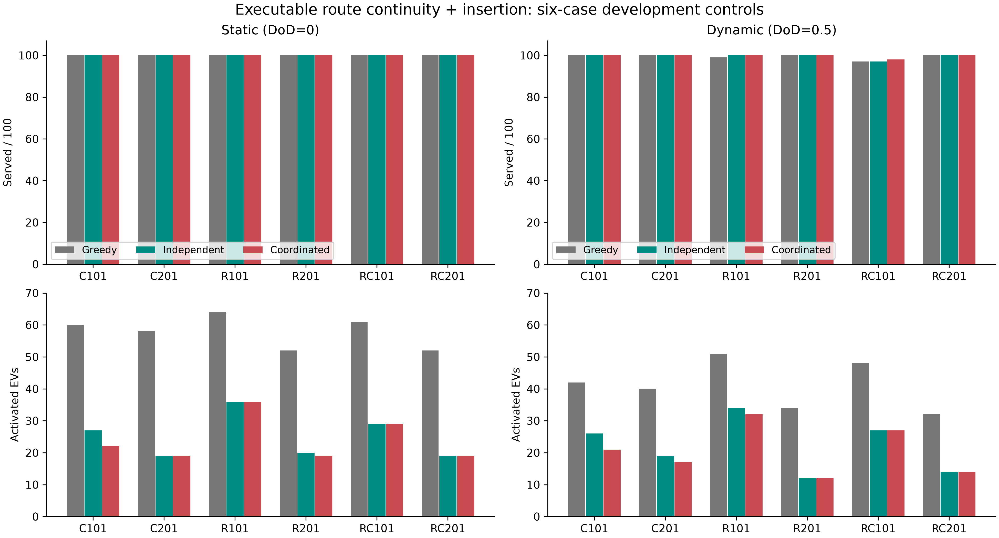

# Route-Continuity Follow-Up: Development Only

**Full paper campaign remains blocked.** Both variants are opt-in, not approved replacements for the paper method.

## Scope

72 unique online controls (36 per variant), six100-customer instances, DoD0/.5, seeds0/0. Four probes per variant reuse grid records and are not additional observations. Hp5/L3, partial charging, limits12/4/5,32 nominal simulations with charged root coverage, lazy reserve K_max=100. All methods share the variant's fleet manager; Greedy has a one-service local horizon. Sequential development timing, one BLAS thread.

## Method Change

Retained feasible suffixes and exclusive ownership replace optimistic unbound tails. Optional due-date-ordered insertion integrates known requests after immutable busy actions. No hidden requests or future releases enter planning. This is a methodological change requiring review, not an equivalent optimization. [Protocol](../../docs/route_continuity_followup.md).

## Coordinated Results

| Instance | Served_static | Served_dynamic | EVs_static | EVs_dynamic | Planning_s_static | Planning_s_dynamic | K_ref |
| --- | --- | --- | --- | --- | --- | --- | --- |
| c101_21 | 100.00 | 100.00 | 22.00 | 21.00 | 2.63 | 2.43 | 13 |
| c201_21 | 100.00 | 100.00 | 19.00 | 17.00 | 2.71 | 2.38 | 5 |
| r101_21 | 100.00 | 100.00 | 36.00 | 32.00 | 2.17 | 1.98 | 20 |
| r201_21 | 100.00 | 100.00 | 19.00 | 12.00 | 2.41 | 2.49 | 4 |
| rc101_21 | 100.00 | 98.00 | 29.00 | 27.00 | 2.27 | 3.56 | 21 |
| rc201_21 | 100.00 | 100.00 | 19.00 | 14.00 | 2.60 | 2.68 | 5 |

All six static cases serve100/100. Dynamic rc101_21 still serves98/100. Coordinated has zero selected WAITs in all12 controls of either variant. Insertion lowers dynamic EV use substantially but does not repair all service losses.

## Method and Ablation Summary

| Variant | Algorithm | DoD | Served | EVs | Planning_s | Waits |
| --- | --- | --- | --- | --- | --- | --- |
| Continuity + insertion | Greedy | 0.000 | 100.00 | 57.83 | 0.096 | 0.000 |
| Continuity + insertion | Independent | 0.000 | 100.00 | 25.00 | 1.94 | 0.000 |
| Continuity + insertion | Coordinated | 0.000 | 100.00 | 24.00 | 2.46 | 0.000 |
| Continuity + insertion | Greedy | 0.500 | 99.33 | 41.17 | 0.127 | 0.167 |
| Continuity + insertion | Independent | 0.500 | 99.50 | 22.00 | 2.15 | 0.000 |
| Continuity + insertion | Coordinated | 0.500 | 99.67 | 20.50 | 2.59 | 0.000 |
| Continuity only | Greedy | 0.000 | 100.00 | 100.00 | 0.041 | 0.000 |
| Continuity only | Independent | 0.000 | 100.00 | 26.83 | 1.67 | 0.000 |
| Continuity only | Coordinated | 0.000 | 100.00 | 27.00 | 2.17 | 0.000 |
| Continuity only | Greedy | 0.500 | 100.00 | 98.83 | 0.055 | 0.167 |
| Continuity only | Independent | 0.500 | 99.83 | 62.17 | 1.70 | 0.000 |
| Continuity only | Coordinated | 0.500 | 99.67 | 62.00 | 2.24 | 0.000 |

Means weight six heterogeneous instances equally; these are not seeded replications. No significance claims. Insertion regresses Independent on dynamic rc101_21 from99 to97 served, and Greedy from100 to97. Lower fleet use is not universal lexicographic improvement. [Paired results](tables/paired_methods.md) report EV differences only at equal service, distance differences only at equal service AND equal fleet.

## Figure

Service and fleet by instance for continuity plus insertion. 36 runs: six instances, two DoD levels, three algorithms; one seed pair (0,0) per bar, no aggregation or error bars. Fleet must be read with service; low fleet with missed customers is not superior. Distance is not plotted. Sequential development executions, not isolated realtime benchmarks. Exact data: figures/service_and_fleet_data.csv.

## Losses and Limitations

[Every unserved customer](tables/unserved_customers.md) is retained for both variants. Coordinated insertion misses C32 and C76 on dynamic rc101_21. Obligations restrict reallocations, and finite horizon, pruning and Top-L can still omit urgent alternatives. Diagnostic labels are not causal proofs. Static service improves and repeated idling is absent here, but dynamic service and fleet efficiency remain unresolved. Coordinated mean service is static100%, dynamic99.67%; dynamic fleet use can still be lower. 32 simulations is a development budget, not a validated final recommendation. No full-charging, Top-L, realtime, robustness or full56-instance campaign was launched.

## Verification

All72 records passed physical replay, release safety, unique service and safe-return audits. Every promised customer is checked against actual future service by its owner. MCTS covers every admissible root action, not every customer excluded by reservations or pruning. See [raw checksums](raw_index.csv), [all controls](tables/all_controls.md) and [test evidence](test_verification.json). V1 and original78-record V2 diagnostics remain separate. Old concurrent96-simulation timings are not a matched speedup baseline. Source snapshots and hashes preserve both development revisions.
