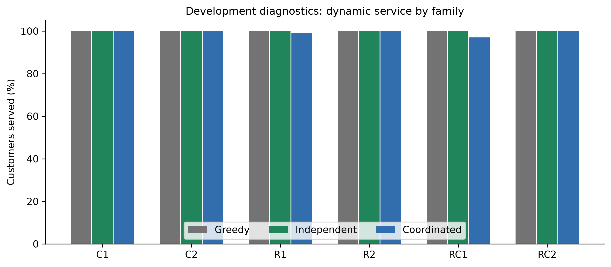
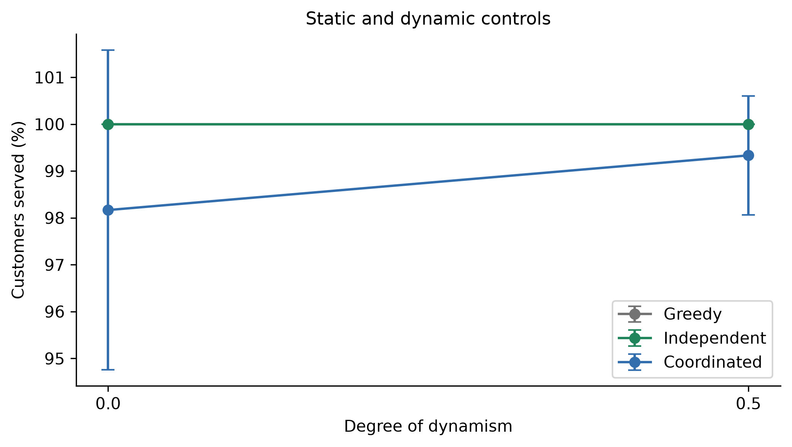
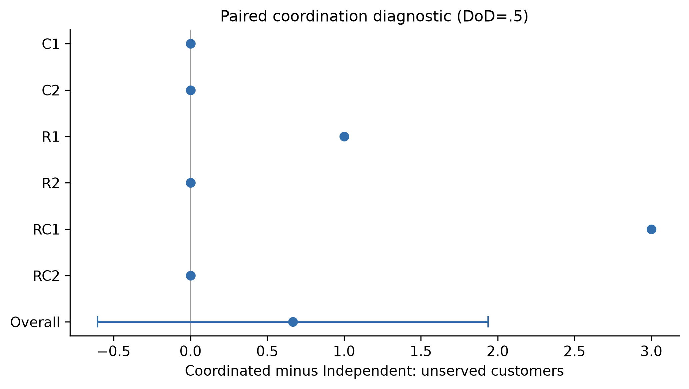
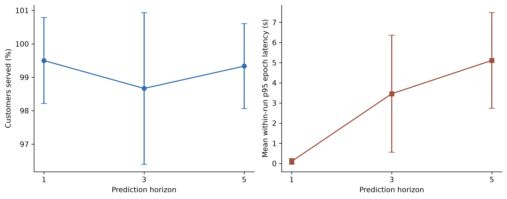
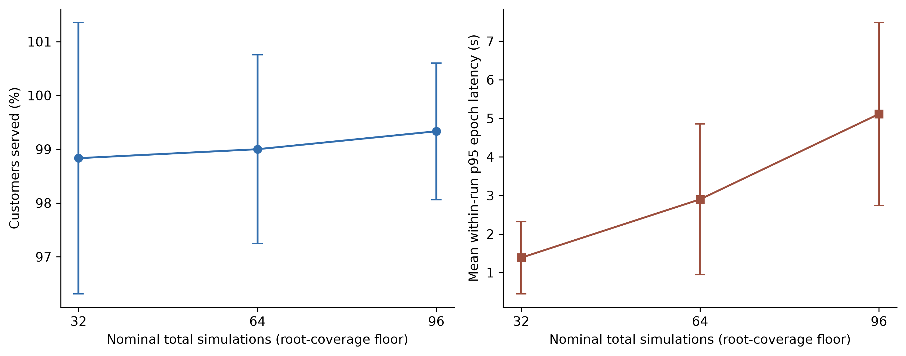
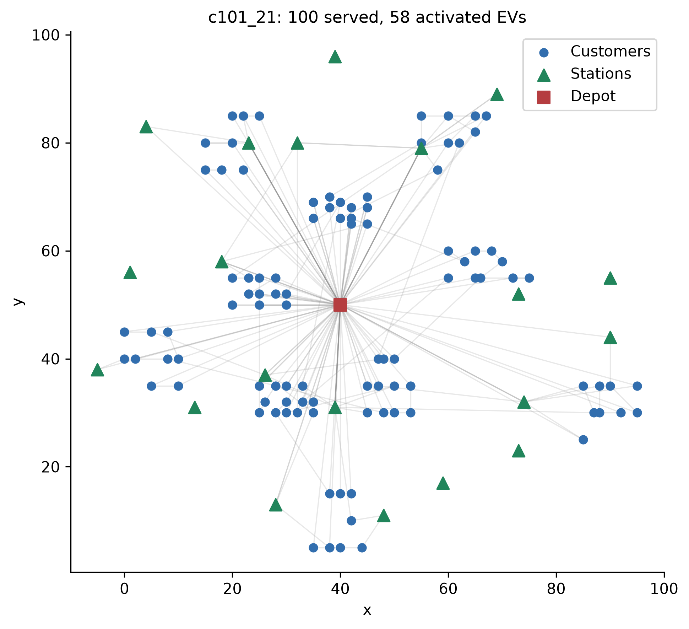
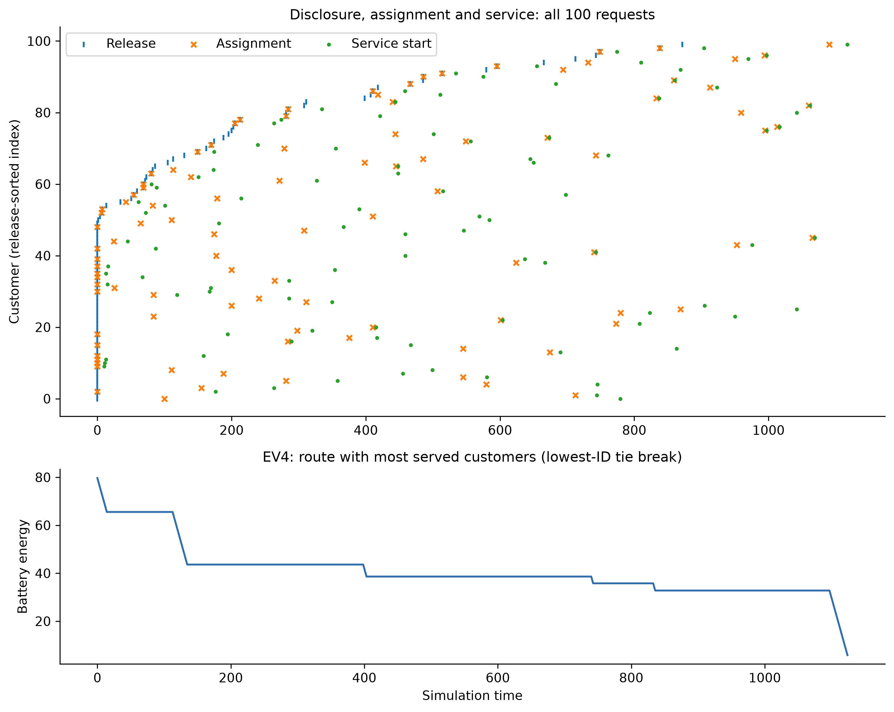

# Diagnostic Figure Captions

All figures are preliminary diagnostics, with PDF vector, PNG300dpi and source CSV.

## service_by_family

Service at DoD=.5 for three online algorithms, six development instances (18 runs). Each family has n=1 per method, so no error bars are identifiable. No distance comparison. Timings in source CSV are concurrent diagnostics, not isolated realtime measurements.

## static_dynamic_service

Mean service at two DoDs, n=6 instances per method/DoD (36 runs). Error bars are untruncated 95% descriptive Student-t intervals across instance means and may extend outside physical percentage bounds. Same paired instances and seeds; not a dense dynamicity sweep. No distance comparison; concurrent diagnostic execution.

## coordination_differences

Paired difference in unserved customers on six identical scenarios at DoD=.5. Each family has one pair (no interval); Overall has six pairs with a 95% descriptive Student-t interval. Negative favors coordination on service only. No fleet/distance superiority inferred. Concurrent diagnostic timing context.

## horizon_tradeoff

Coordinated horizon diagnostic at DoD=.5, n=6 development instances per setting (18 conditions). Other online settings fixed, except the chosen horizon/budget factor. Error bars are 95% descriptive Student-t intervals across instances. Actual simulations include mandatory root coverage; latency includes concurrent machine contention and is not an isolated realtime guarantee. No distance panel.

## budget_tradeoff

Coordinated budget diagnostic at DoD=.5, n=6 development instances per setting (18 conditions). Other online settings fixed, except the chosen horizon/budget factor. Error bars are 95% descriptive Student-t intervals across instances. Actual simulations include mandatory root coverage; latency includes concurrent machine contention and is not an isolated realtime guarantee. No distance panel.

## representative_routes

Pre-specified c101_21 coordinated run, DoD=.5, seeds0 (n=1 trajectory). All activated route arcs are shown in gray to avoid a large indistinguishable color legend; depot/stations/customers are distinct. Complete service is required for this figure, but the vehicle count is disclosed and no optimality claim is made. No error bars or distance comparison. Concurrent diagnostic planning.

## representative_evolution

Same pre-specified n=1 c101_21 run. Top: all100 release, assignment and service times, ordered by release then ID. Bottom: EV4, chosen by maximum served count with smallest-ID tie break, with exact travel/charging SOC points. Other EVs are not hidden from the route/source records. No uncertainty bars, distance comparison or population inference. Concurrent planning; horizontal axes are physical simulation time.

